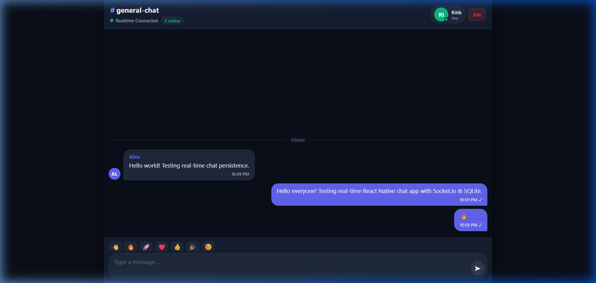
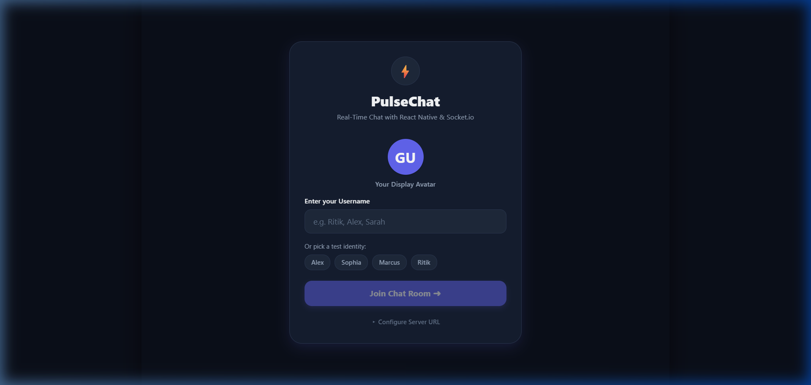
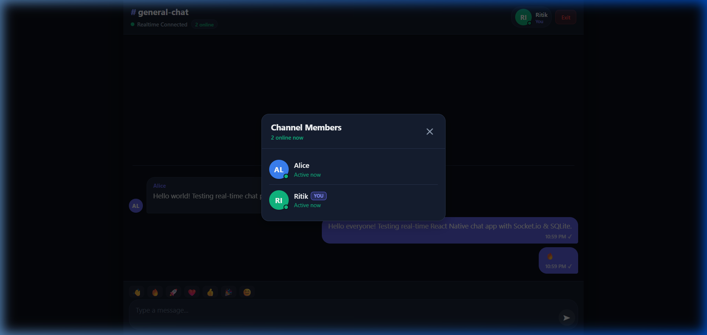

# ⚡ PulseChat - Real-Time Chat Application

A high-performance, real-time chat application built using **React Native (Expo)** on the frontend and **Node.js + Express + Socket.io** with **SQLite** on the backend.



---

## 🌟 Key Features

### 1. Frontend (React Native & Web)
- **Cross-Platform**: Built with React Native and Expo; runs seamlessly on **Android**, **iOS**, and **Web Browser**.
- **Real-Time Delivery**: Messages are dispatched and received instantly with zero page reloads via **Socket.io**.
- **Chat History Persistence**: Previous conversations are loaded directly from the database upon application launch and on pull-to-refresh.
- **Timestamps & Smart Date Headers**: Clean time formatting (`HH:mm A`) with dynamic date dividers (`Today`, `Yesterday`, etc.).
- **Interactive UI**:
  - Distinct sender (right-aligned accent bubble) vs recipient (left-aligned surface bubble) styles.
  - Delivery ticks (✓ Sent, ✓✓ Delivered/Read).
  - Quick emoji reactions bar (`👋`, `🔥`, `🚀`, `❤️`, `👍`, `🎉`, `😊`).
  - Auto-scroll to latest messages.

### 2. Backend (Node.js + Express + Socket.io)
- **REST APIs**:
  - `GET /api/messages` - Fetch persisted chat history with limit & pagination support.
  - `POST /api/messages` - Send a message via REST, which also broadcasts in real-time to active socket clients.
  - `POST /api/login` - Username-based authentication and user session creation.
  - `GET /api/users/online` - Live list of currently connected users.
  - `GET /api/health` - Service health monitor.
- **Real-Time Communication**:
  - Instant broadcasting with `socket.emit` and `socket.broadcast`.
  - Graceful connection and disconnection lifecycle management.
  - Multi-tab / multi-device socket mapping per user.
- **Database Persistence**:
  - Embedded zero-configuration **SQLite** database (`chat.db`).
  - Indexed for fast retrieval by timestamp.

### 3. Bonus Features Implemented
- ✅ **Username-Based Login**: Dummy authentication with avatar generator and quick demo switcher.
- ✅ **Typing Indicator**: Real-time bouncing animated dots and label (`Alex is typing...`).
- ✅ **Online/Offline User Status**: Live badge indicator and interactive Channel Members modal.
- ✅ **Message Read/Delivered Status**: Instant visual feedback on delivery and read receipts.
- ✅ **SQLite Persistence**: Complete history retention even across server/app restarts.
- ✅ **Android APK Ready**: Pre-configured EAS build configuration (`eas.json`).

---

## 📸 Screenshots

| Login & Identity Picker | Real-Time Chat Screen | Active Members & Online Status |
| :---: | :---: | :---: |
|  |  |  |

---

## 📁 Project Architecture

```
chatapp/
├── backend/
│   ├── src/
│   │   ├── config/
│   │   │   └── database.js          # SQLite connection and migrations
│   │   ├── controllers/
│   │   │   ├── messageController.js # REST API logic for messages
│   │   │   └── authController.js    # REST API logic for user/auth
│   │   ├── models/
│   │   │   ├── messageModel.js      # Database queries for messages
│   │   │   └── userModel.js         # Database queries for users
│   │   ├── routes/
│   │   │   ├── messageRoutes.js     # /api/messages routes
│   │   │   └── authRoutes.js        # /api/login and /api/users routes
│   │   ├── sockets/
│   │   │   └── chatSocket.js        # Socket.io event handlers
│   │   ├── middleware/
│   │   │   └── errorHandler.js      # Global error and 404 handler
│   │   ├── app.js                   # Express app setup & middleware
│   │   └── server.js                # Server entrypoint
│   ├── .env.example
│   └── package.json
├── frontend/
│   ├── src/
│   │   ├── api/
│   │   │   └── chatApi.js           # REST API client
│   │   ├── components/
│   │   │   ├── ChatHeader.js        # Channel title, status & profile
│   │   │   ├── MessageBubble.js     # Sender/receiver bubbles & ticks
│   │   │   ├── MessageInput.js      # Multiline input & quick emojis
│   │   │   ├── TypingIndicator.js   # Animated 3-dot typing pulse
│   │   │   ├── UserAvatar.js        # Initials avatar with status badge
│   │   │   ├── OnlineUsersModal.js  # Live members list modal
│   │   │   └── EmptyChat.js         # Empty state welcome view
│   │   ├── config/
│   │   │   └── constants.js         # Dynamic backend URL resolver
│   │   ├── screens/
│   │   │   ├── LoginScreen.js       # Login & server settings
│   │   │   └── ChatScreen.js        # Chat room & socket lifecycle
│   │   ├── services/
│   │   │   └── socketService.js     # Socket.io client manager
│   │   ├── theme/
│   │   │   └── colors.js            # Design tokens & color system
│   │   └── utils/
│   │       └── helpers.js           # Date and initial formatters
│   ├── App.js                       # Root React Native application
│   ├── app.json                     # Expo & Android configuration
│   ├── eas.json                     # EAS Android APK build config
│   └── package.json
├── screenshots/                     # UI screenshots
├── package.json                     # Root orchestrator script
└── README.md
```

---

## 🚀 Quick Start Guide

### Prerequisites
- [Node.js](https://nodejs.org/) (v18 or higher recommended)
- `npm` or `yarn`

### 1. Install Dependencies

You can install all dependencies from the root directory:

```bash
# In the root repository
npm install

# Install backend dependencies
cd backend && npm install

# Install frontend dependencies
cd ../frontend && npm install --legacy-peer-deps
```

---

### 2. Running Both Services Together (One Command)

From the root repository:

```bash
npm run dev
```

This launches:
- Backend server on `http://localhost:5000`
- Frontend Metro bundler on `http://localhost:8081`

---

### 3. Running Services Individually

#### Running the Backend:
```bash
cd backend
npm run dev
# Server will run on http://localhost:5000
```

#### Running the Frontend:
```bash
cd frontend

# Run in Web Browser
npm run web

# Or run on Android Emulator / Physical Device (via Expo Go)
npm run android
```

---

## ⚙️ Environment Variables

### Backend (`backend/.env`)

Create a `.env` file inside `backend/`:

```env
PORT=5000
NODE_ENV=development
CLIENT_URL=*
DB_PATH=./data/chat.db
```

| Variable | Description | Default |
| :--- | :--- | :--- |
| `PORT` | Port for Express & Socket.io HTTP server | `5000` |
| `NODE_ENV` | Environment mode (`development` / `production`) | `development` |
| `CLIENT_URL` | Allowed CORS origin | `*` |
| `DB_PATH` | Path to the SQLite database file | `./data/chat.db` |

---

## 📡 REST API Reference

### 1. Fetch Chat History
- **Endpoint**: `GET /api/messages`
- **Query Parameters**:
  - `limit` *(optional)*: Number of messages to return (default: `100`)
  - `before` *(optional)*: Fetch messages created before timestamp
- **Response**:
```json
{
  "success": true,
  "count": 2,
  "data": [
    {
      "id": "5ef5ec3c-3557-4394-86db-285a34295744",
      "sender": "Alice",
      "recipient": "all",
      "text": "Hello world! Testing real-time chat persistence.",
      "timestamp": 1790529589013,
      "status": "delivered",
      "created_at": "2026-09-27 17:19:49"
    }
  ]
}
```

### 2. Send Message (REST Endpoint)
- **Endpoint**: `POST /api/messages`
- **Request Body**:
```json
{
  "sender": "Ritik",
  "text": "Hello from REST API!",
  "recipient": "all"
}
```
- **Response**: `201 Created`

### 3. Dummy Authentication / Login
- **Endpoint**: `POST /api/login`
- **Request Body**:
```json
{
  "username": "Ritik"
}
```

### 4. Fetch Online Users
- **Endpoint**: `GET /api/users/online`

### 5. Health Check
- **Endpoint**: `GET /api/health`

---

## ⚡ Socket.io Real-Time Protocol

| Event Name | Direction | Payload | Description |
| :--- | :--- | :--- | :--- |
| `user_join` | Client ➔ Server | `{ username }` | Registers user socket session and sets online status |
| `send_message` | Client ➔ Server | `{ sender, text, tempId }` | Sends message, persists to SQLite, triggers broadcast |
| `receive_message` | Server ➔ Client | `{ id, sender, text, timestamp, status, tempId }` | Broadcasted immediately to all connected clients |
| `typing_start` | Client ➔ Server | `{ username }` | Informs peers that user started typing |
| `typing_stop` | Client ➔ Server | `{ username }` | Informs peers that user stopped typing |
| `user_typing` | Server ➔ Client | `{ username, isTyping }` | Broadcasted typing state |
| `user_status_change` | Server ➔ Client | `{ username, isOnline }` | Broadcasted when a user joins or disconnects |
| `online_users_list` | Server ➔ Client | `[ { username, is_online, ... } ]` | Live list of online members |
| `mark_read` | Client ➔ Server | `{ messageId, reader }` | Updates message status in database and notifies sender |

---

## 📱 Generating an Android APK

The project includes an `eas.json` file configured for direct APK generation:

```bash
cd frontend

# 1. Install EAS CLI globally (if not already installed)
npm install -g eas-cli

# 2. Login to your Expo account
eas login

# 3. Build standalone APK
eas build -p android --profile preview
```

The CLI will build the `.apk` in the cloud and provide a direct download link, ready for installation on any Android device.

---

## 💡 Design Decisions & Assumptions

1. **React Native with Expo**:
   - Enables a single codebase targeting Android, iOS, and Web.
   - Provides native mobile performance while allowing instant in-browser debugging and demonstration.
2. **SQLite for Persistence**:
   - Chosen because it requires zero external service setup (unlike MongoDB/PostgreSQL which require running background server daemons).
   - Entirely self-contained, robust, and performs ACID-compliant transactions.
3. **Dual Delivery (Socket.io + REST fallback)**:
   - Primary messaging is handled over Socket.io for instantaneous bidirectional delivery.
   - If a client's socket connection experiences a temporary network blip, the REST endpoint serves as a reliable fallback.
4. **Optimistic UI Updates**:
   - Messages appear instantly in the chat with a temporary ID and pending indicator, then update to `sent` once the server acknowledges receipt.
